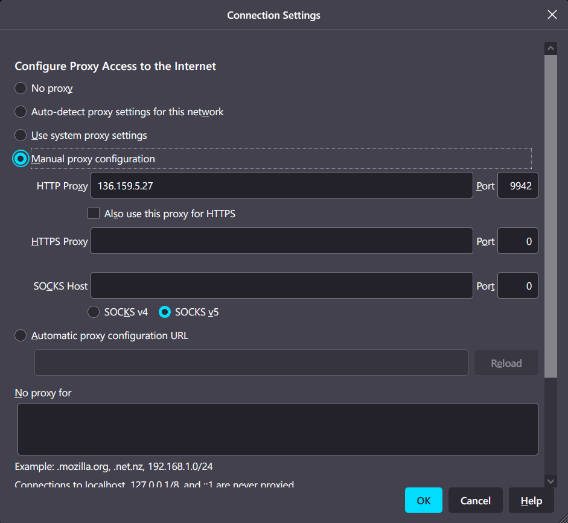

# Censorship Proxy User Manual

## Functionality implemented
1. Handle simple GET interactions between client and server (for any HTTP website)
2. Parse HTTP requests and responses and block content
3. Dynamically update block list
4. This user mannual

## References
1. [StringExtension by Honnef](https://github.com/eHonnef/string-operations-cpp)
2. [Console Colorful Output by aguaniyal](https://github.com/agauniyal/rang)
3. [Shared memory between processes](https://www.boost.org/doc/libs/1_54_0/doc/html/interprocess/sharedmemorybetweenprocesses.html)
4. [Class mapped_region](https://www.boost.org/doc/libs/1_53_0/doc/html/boost/interprocess/mapped_region.html)

## Usage

### Compile
First, have all the three files under the same directory, they are: `proxy.cpp`, `string.cc` and `color.hpp`.

In the terminal, run the following code to compile and run.

```
g++ -lrt proxy.cpp
./a.out
```

### Configurations
### Run

Connection to the linux server of the university. The server must be **csx** servers, the ip address must be **136.159.5.xx**. In the terminal, run `ifconfig` and find the ip address of the server.

Open the firefox browser, open settings page, and go to the bottom and click "settings" button under Network Settings section. Select "Manual proxy condiguration" option and paste the ip address inside "HTTP proxy" textbox.

The program will first show two ports, one for client and one for blocking. The two ports are working synchronously and they both accept multiple connections.

```
CONNECT at PORT: 9942
BLOCK at PORT: 9952
```

Please ignore any `bind() call failed` which may appear between lines, the program was keep trying another port when one was not working.

In firefox, put the client port number into port textbox.

Your firefox proxy settings should end up with something looks like this:



And now, you can browse any HTTP webpage!


### Block

In the server terminal, run the following code to connect to the block port: 
```
telnet <server_ip> <block_port>
```

For blocking sensitive words, run `BLOCK <word>` in the blocking terminal and press enter. To unblock, run `UNBLOCK <word>` to unblock. Any invalid command will be silently ignored. 

```
BLOCK <word>
UNBLOCK <word>
```

Theoretically, the block list can only contain 1000 characters. For each word, there are `n+1` characters stored.

When press `Ctr` + `C` to terminate the program, the block terminal will end at the same time.

## Notes

Please do not compile it through arm server (arm.cpsc.ucalgry.ca) or run it through linuxlab server (linuxlab.cpsc.cualgary.ca) because arm g++ cannot compile correctly and linuxlab has the firewall that cannot receive any client requests.


## Tests 

The code was implemented and compiled and tested all time in the linux server of the university (linux.cpsc.ucalgary.ca), connected from home and university. You can  use any linux server which name starts with `csx`, such as `csx1.cpsc.ucalgary.ca` or `csx3.cpsc.ucalgary.ca`.

The following are tested and fully worked:
- Connect to client port and load a page: configure proxy settings and visit a HTTP webpage  
- Connect to block port: run `telnet 136.159.5.27 9942`  
- Block a word: run command `BLOCK Floppy`  
- Block multiple words: run multiple times of `BLOCK <word>`
- Unblock a word: run command `UNBLOCK Floppy`   
- Unblock multiple words: run multiple times of `UNBLOCK <word>`  
- Visit HTTP websites: visit `pages.cpsc.ucalgary.ca` and other HTTP websites  
- Visit remote images: visit Floppy image 

The following will not work:
- Block words detected in the response body: not implemeneted in the code  
